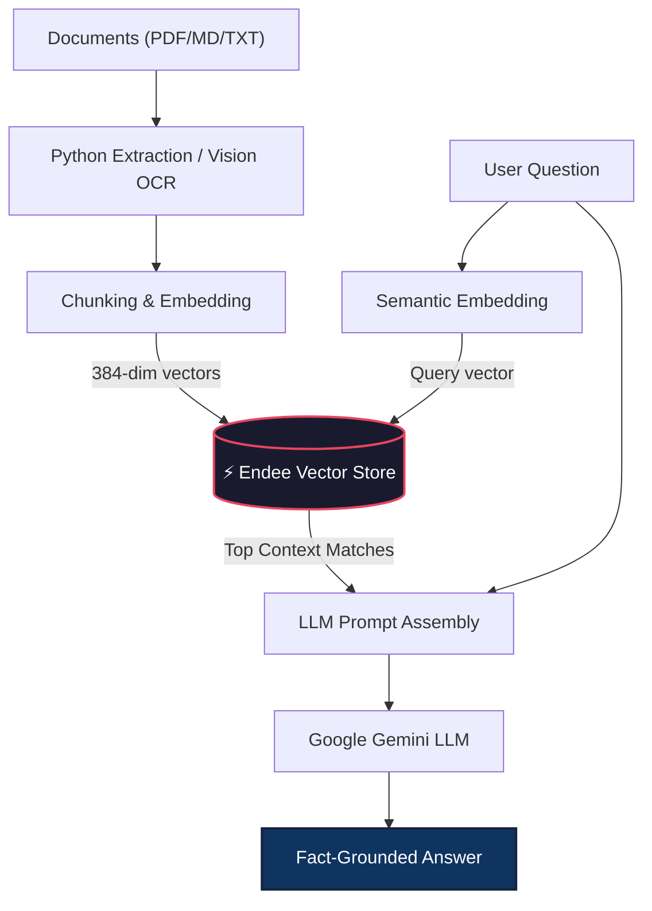

# ⚡ Curator AI: Enterprise Knowledge Engine & Analytics

A premium **Retrieval-Augmented Generation (RAG)** platform built on **Endee**, a blazingly fast open-source vector database. Curator AI transforms static documents into a dynamic, searchable, and intelligent private database with a state-of-the-art UI/UX.

*🌐 Live Demo*: [Live](https://vikash9546-endee-assignmentapp-uhvshp.streamlit.app/)

---

## 💎 Key Features

### 1. 🤖 AI Knowledge Assistant (Premium RAG)
Ask complex questions about your private documents. The system retrieves the most relevant context from Endee to provide accurate, fact-grounded answers.
- **Visual OCR Support**: Integrated Gemini Vision reads handwritten notes or scanned PDFs.
- **Stateful Memory**: Maintains context for fluid, multi-turn technical conversations.
- **Sleek Glassmorphism UI**: A modern, theme-aware interface that adapts to Light and Dark modes.

### 2. 📊 Intelligent Knowledge Analytics
Gain deep insights into your knowledge base performance and user curiosity.
- **Real-time Velocity Tracking**: Monitor query volume and retrieval speeds via dynamic area charts.
- **Topic Clustering**: Identify "Market Analysis" trends and other most-queried topics automatically.
- **Document Health**: Track ingestion statistics and growth metrics (+12% vs LW).

---

## 🚀 How It Works

| Step | Functionality | Powered By |
|------|---------------|------------|
| **1. Text Extraction** | Parses PDF, MD, and Text (including Vision OCR) | `PyMuPDF` + `Gemini-Flash` |
| **2. Vectorization** | Converts text into 384-dim semantic embeddings | `S-Transformers` |
| **3. Vector Storage** | Blazing-fast indexing and similarity search | **Endee Vector Database** |
| **4. Retrieval** | Finds the top context chunks for any query | `Endee.query()` |
| **5. Generation** | Generates professional, grounded answers | **Google Gemini 2.0-Flash** |

### System Architecture


---

## 🛠️ Quick Start (Local Setup)

### 1. Clone & Install
```bash
git clone https://github.com/Vikash9546/endee.git
cd endee/assignment
python3 -m venv .venv && source .venv/bin/activate
pip install -r requirements.txt
```

### 2. Launch Endee Database
You can run Endee via Docker or by building the source:
```bash
# Via Docker
docker run -p 8080:8080 endeeio/endee-server:latest
```

### 3. Run the Dashboard
Ensure your `.env` file contains your `GEMINI_API_KEY`:
```bash
streamlit run app.py
```

---

## 📁 Project Structure

- `assignment/app.py`: Main entry point (State management & Analytics logic).
- `assignment/ui.py`: Premium Styling Engine (Glassmorphism & Theme detection).
- `assignment/logic.py`: Core RAG Pipeline (Endee Indexing, Chunking, LLM).
- `assignment/assets/`: Branding and profile media.
- `assignment/stats.json`: Persistent analytics storage.

---

## ☁️ Cloud Deployment

Curator AI is optimized for **Streamlit Cloud** and **Railway**.

1.  **Database (Railway)**: Deploy `endeeio/endee-server` and set `PORT` to `8080`.
2.  **Frontend (Streamlit Cloud)**: Connect your repo and set `GEMINI_API_KEY` and `NDD_URL` as secrets.
