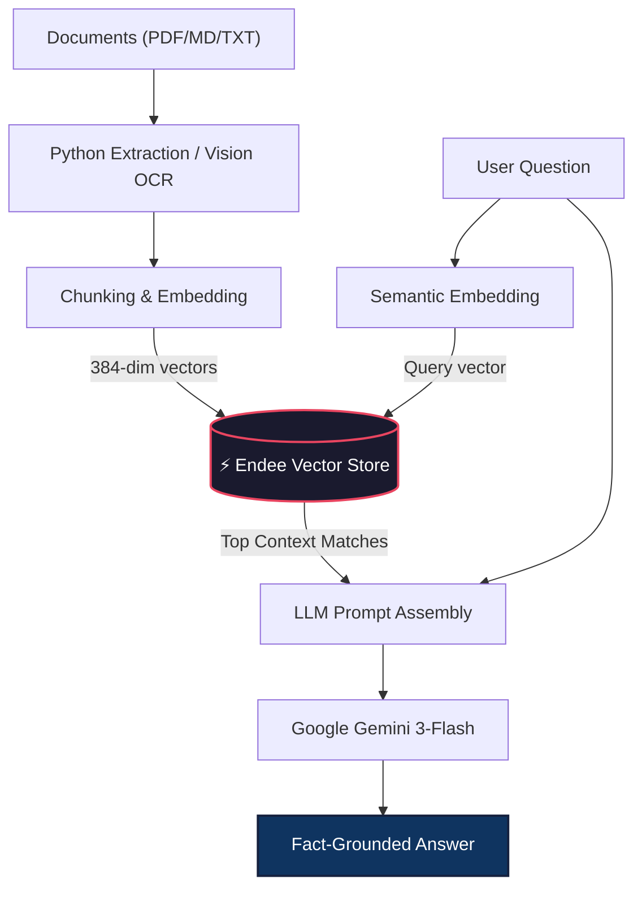

# ⚡ Endee RAG Knowledge Base & Agentic Memory

A high-performance **Retrieval-Augmented Generation (RAG)** and **Autonomous Agent** a blazingly fast open-source vector database built for AI memory.

This project demonstrates how to build a production-grade AI system using Endee as the "Long-Term Memory" to power deep document chat and autonomous incident response.

*🌐 Live Demo*: [Live](https://vikash9546-endee-assignmentapp-uhvshp.streamlit.app/)

---

## Key AI Features

### 1. 🤖 AI Knowledge Assistant (CORE RAG)
Ask complex questions about your private documents. The system retrieves the most relevant context from Endee to provide accurate, cited answers.
- **Visual OCR Support**: Uses Gemini Vision to read and extract text from handwritten notes or scanned PDFs.
- **Stateful Memory**: Maintains chat history for fluid, multi-turn conversations.
- **Smart Quota Management**: Features model rotation and backoff logic to ensure reliability on Gemini's free tier.

### 2. Ghost-Protocol: Agentic AI Memory
Simulates an **Autonomous SRE Agent** that uses Endee to handle server incidents.
- **Experience-Driven Decisions**: When an error occurs, the agent consults Endee to find high-similarity past solutions.
- **Auto-Fix vs. Escalate**: Decides whether to automatically execute a fix for "Easy" known issues or escalate to a human with full context for "Hard" novel problems.

---

## How It Works

| Step | Functionality | Powered By |
|------|---------------|------------|
| **1. Text Extraction** | Parses PDF, MD, and Text (including OCR for images) | `PyMuPDF` + `Gemini Vision` |
| **2. Vectorization** | Converts text into 384-dim semantic embeddings | `sentence-transformers` |
| **3. Vector Storage** | Blazing-fast indexing and similarity search | **Endee Vector Database** |
| **4. Retrieval** | Finds the top context chunks for any query | `Endee.query()` |
| **5. Generation** | Generates professional, grounded answers | **Google Gemini 3-Flash** |

### System Architecture


---

## Quick Start (Local Setup)

### 1. Clone & Install
```bash
git clone https://github.com/Vikash9546/endee.git
cd endee/assignment
python3 -m venv .venv && source .venv/bin/activate
pip install -r requirements.txt
```

### 2. Launch Endee Database
```bash
docker compose up -d
```

### 3. Run the Dashboard
Ensure your `.env` file contains your `GEMINI_API_KEY`:
```bash
streamlit run app.py
```

---

## Cloud Deployment (The "Best" Way)

This project is optimized for deployment on **Streamlit Cloud** and **Railway**.

### 1. Database (Railway.app)
Deploy the `endeeio/endee-server:latest` image to Railway. 
- Set `PORT` to `8080`.
- Generate a public domain (e.g., `https://endee-server.up.railway.app`).

### 2. Frontend (Streamlit Cloud)
Connect your GitHub repo to Streamlit Cloud and add the following **Secrets**:
```toml
GEMINI_API_KEY = "your_gemini_key"
NDD_URL = "https://your-railway-url.up.railway.app/api/v1"
```

---

## 📁 Project Structure

- `app.py`: Main Dashboard (Management UI + Chat).
- `ingest.py`: Pipeline for mass-vectorizing folder data.
- `incident_agent.py`: CLI implementation of the Agentic Memory logic.
- `query.py`: Direct CLI interface for RAG queries.
- `data/`: Sample technical documentation for testing.

