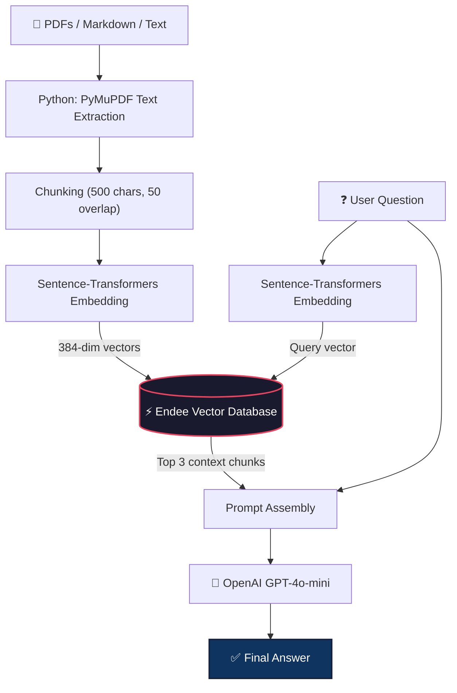

# ⚡ Endee RAG Knowledge Base

A **Retrieval-Augmented Generation (RAG)** chatbot powered by [Endee](https://github.com/endee-io/endee) — a high-performance open-source vector database built for AI search.

Upload technical docs (PDFs, Markdown, Text), and the chatbot answers questions based **only** on those documents.

---

## Problem Statement

Traditional keyword search fails when users ask conceptual questions like *"How do I connect Prisma to MongoDB?"*. This project solves that with **semantic search** — it understands the *meaning* behind a query, retrieves the most relevant chunks from your documents stored in Endee, and feeds them to an LLM to generate a precise answer.

---

## How It Works

### The Python Workflow

| Step | What Happens | Tool Used |
|------|-------------|-----------|
| **1. Extract Text** | Read PDFs, Markdown, and `.txt` files | `PyMuPDF (fitz)` |
| **2. Chunking** | Split text into ~500-character overlapping pieces | Custom chunker |
| **3. Embeddings** | Convert each chunk into a 384-dim vector | `sentence-transformers/all-MiniLM-L6-v2` |
| **4. Store in Endee** | Upsert vectors + metadata into the vector database | `endee` Python SDK |
| **5. Retrieve** | User question → vector → find top 3 closest chunks in Endee | `Endee.query()` |
| **6. Generate** | Send chunks + question to LLM → get a grounded answer | `OpenAI GPT-4o-mini` |

```python
# Embedding example (Step 3)
from sentence_transformers import SentenceTransformer
model = SentenceTransformer('all-MiniLM-L6-v2')
vector = model.encode("How to connect Prisma to MongoDB?")
```

### Architecture Diagram



---

## Quick Start (3 Commands)

### Prerequisites
- Python 3.10+
- Docker installed and running

### 1. Install dependencies
```bash
git clone https://github.com/Vikash9546/Endee-RAG-Demo.git
cd Endee-RAG-Demo
python3 -m venv venv && source venv/bin/activate && pip install -r requirements.txt
```

### 2. Start Endee + ingest sample docs
```bash
docker run -d -p 8080:8080 --name endee endeeio/endee-server:latest && python ingest.py
```

### 3. Query the knowledge base
```bash
# Option A: Use Google Gemini (FREE — get key at https://aistudio.google.com/apikey)
export GEMINI_API_KEY="gemini_api_key"
python query.py "What is Endee built for?"

# Option B: Use OpenAI GPT-4o-mini (paid)
export OPENAI_API_KEY="sk-your-key-here"
python query.py "What is Endee built for?"
```

> **How it works:** The script tries OpenAI first, then falls back to Gemini. If neither key is set, it still returns the raw semantic search results from Endee.

---

### Option 3: "Ghost-Protocol" (Agentic AI Workflow)
An AI agent that can "browse" its own memory to complete a multi-step task for **Automated Incident Response**.
```bash
python incident_agent.py
```
This runs an autonomous loop where the agent:
1. Receives a server crash error.
# ⚡ Endee AI: Knowledge & Agentic Memory Platform

A high-performance implementation of **RAG (Retrieval Augmented Generation)** and **Autonomous Agent Operations** using the **Endee Vector Database**.

---

### 🚀 Core Features

#### 1. 🤖 AI Knowledge Assistant (Stateful RAG)
A professional-grade conversational interface that allows you to chat with your private documents.
- **Deep PDF/MD Ingestion**: Parses and chunks documents into Endee.
- **Stateful Memory**: Remembers chat history for fluid, multi-turn follow-ups.
- **Grounding & Citations**: Answers are strictly based on provided context with automatic source attribution.
- **Gemini 3-Flash Integration**: Uses the latest fast-inference models for near-instant responses.

#### 2. 🕵️ Agentic AI Memory (Ghost-Protocol)
An autonomous "Incident Response" agent that uses Endee as its long-term stateful memory.
- **Autonomous Decision Engine**: Detects the severity of incoming alerts.
- **Memory-Driven Logic**: Consults past "experience" in Endee to decide whether to **Auto-Fix** a server or **Escalate** to a human.
- **Persistent State**: Learns from every past incident logged in the vector store.

---

### 🛠️ Quick Start

1. **Install Dependencies**:
```bash
pip install -r requirements.txt
```

2. **Configure Environment**:
Create a `.env` file with:
```env
GEMINI_API_KEY=your_key_here
```

3. **Launch the Dashboard**:
```bash
streamlit run app.py
```

---

### 📁 Project Structure
- `app.py`: The main Streamlit dashboard featuring both AI modes.
- `incident_agent.py`: CLI logic for the Ghost-Protocol agent.
- `ingest.py`: Core logic for vectorizing text data into Endee.
- `query.py`: Script for direct semantic querying of the vector store.

---
© 2026 Endee AI Project. Built for high-speed intelligence.

---

## How Endee Is Used

Endee is the **core component** of this application — it acts as the "memory" for the AI:

1. **Index Creation** — We create a vector index with `dimension=384`, `space_type="cosine"`, and `precision=FLOAT32` via `client.create_index()`.
2. **Upserting Vectors** — Document chunks are embedded and stored with `index.upsert()`, including metadata (source file, chunk text, chunk index).
3. **Querying** — User questions are embedded with the **same model** and sent to `index.query(vector=..., top_k=3)` for nearest-neighbor retrieval.
4. **RAG Pipeline** — The top 3 matching chunks from Endee are injected into the LLM prompt as grounding context, ensuring the AI answers based on *your* documents.

---

## Project Structure

```
endee-rag-demo/
├── app.py               # Streamlit chatbot UI (upload PDFs, ask questions)
├── ingest.py            # Ingestion pipeline: extract → chunk → embed → upsert
├── query.py             # CLI: semantic search + RAG generation
├── recommendation.py    # Bonus: product recommendation via vector similarity
├── agent.py             # Bonus: agentic AI memory pattern using Endee
├── data/                # Place your PDFs / Markdown / Text files here
│   └── endee_overview.md
├── docker-compose.yml   # One-command Endee server setup
├── requirements.txt     # Python dependencies
└── README.md            # This file
```

---

## Example Output

```
╔══════════════════════════════════════════════════╗
║   Endee Knowledge Base — RAG Query Engine       ║
╚══════════════════════════════════════════════════╝

[1/3] Encoding question: "What is Endee built for?"
[2/3] Querying Endee for top 3 matching chunks...

  🔍  SEMANTIC SEARCH RESULTS (from Endee)
=======================================================

  [1] data/endee_overview.md  (distance: 0.4544)
      # Endee: High-Performance Vector Database ...

  [2] data/endee_overview.md  (distance: 0.4669)
      Endee is a specialized, open-source vector database ...

  🤖  RAG GENERATION (LLM + Endee Context)
=======================================================

  ╔══════════════════════════════════════════════╗
  ║  ✨  FINAL ANSWER                           ║
  ╚══════════════════════════════════════════════╝

  Endee is built for speed, efficiency, and scale required
  by production AI systems. It supports semantic search,
  RAG workflows, agentic memory, and hybrid search...
```

---

## Tech Stack

| Component | Technology |
|-----------|-----------|
| Vector Database | [Endee](https://github.com/endee-io/endee) |
| Embeddings | `sentence-transformers/all-MiniLM-L6-v2` |
| PDF Extraction | `PyMuPDF` |
| LLM | OpenAI `gpt-4o-mini` |
| Frontend | Streamlit |
| Containerization | Docker |

---

## License

MIT
